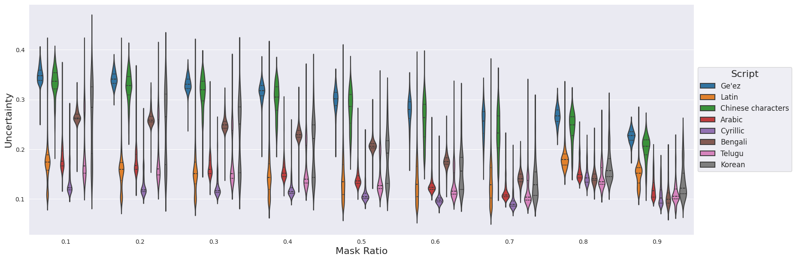
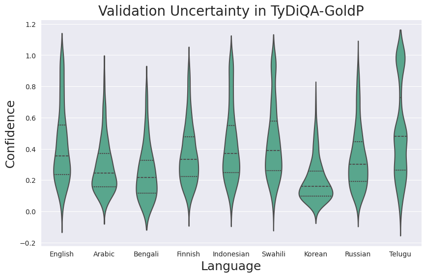
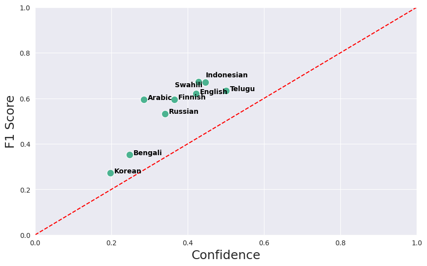

# Uncertainty in Semantic Language Modeling with PIXELS

MSc Artificial Intelligence Thesis by Stefania Radu \
University of Groningen, The Netherlands

Abstract: *Traditional Language Models like BERT are trained using raw text, split into separate chunks using a tokenizer. These models suffer from 3 main challenges: a lack of context understanding, a bottleneck in the vocabulary, and unreliable predictions caused by high epistemic uncertainty. This study investigates a new approach - Visual Language Models (VLMs) - by rendering text as an image and replacing the masked language modeling task with patch reconstruction at the pixel level. The novelty of this work consists of analysing uncertainty and confidence in VLMs models across 18 languages and 7 scripts, all part of 3 semantically challenging tasks: Named Entity Recognition (NER), Sequence Classification (SC), and Question-Answering (QA). This is achieved through several Uncertainty Quantification methods such as Monte Carlo Dropout, Transformer Attention, and Ensemble Learning. The results suggest that VLMs underestimate uncertainty when reconstructing patches, especially when a large proportion of the image is masked. The uncertainty is also influenced by the script, with Latin languages displaying lower uncertainty, compared to the Geʽez or Chinese Characters scripts. The findings on ensemble learning show better performance when applying hyperparameter tuning during the NER and QA tasks across 16 languages, as well as improved overall calibration.*

The code is based on the PIXEL model (Rust et. al, 2022): [README_PIXEL](README_PIXEL.md) 

## Languages used in the experiments

<p align="middle">
 </img>
</p>

## Uncertainty in PIXEL Text Reconstruction


### The effect of mask ratio on uncertainty across datasets and languages

Vary the mask ratio between 0.1 and 0.9.

Example run for mask_ratio = 0.9. The experiment type is mask_ratio.

```bash
python scripts/monte_carlo/monte_carlo_experiments.py \
  --input_data_path="scripts/data/uncertainty/test_data_ner_tydiqa_glue_1000.json" \
  --model_name_or_path="Team-PIXEL/pixel-base" \
  --experiment_type="mask_ratio" \
  --do_loss \
  --do_std \
  --mask_ratio=0.9 \
  --masking_spacing=0 \
  --masking_max_span_length=6 \
  --masking_cumulative_span_weights="0.2,0.4,0.6,0.8,0.9,1" \
  --span_mask \
  --max_seq_length=256 \
```

Inputs:
- [.json file](scripts/data/uncertainty/test_data_ner_tydiqa_glue_1000.json) containing the test split examples in the form of text-data per id, per language, per task.

The maximum number of examples used is limited to 1000.

### NER
Counts: {'amh': 500, 'conll_2003_en': 1000, 'hau': 552, 'ibo': 638, 'kin': 605, 'lug': 407, 'luo': 186, 'pcm': 600, 'swa': 604, 'wol': 539, 'yor': 645, 'zh': 1000}

### Tydiqa
Counts: {'arabic': 921, 'russian': 812, 'bengali': 113, 'telugu': 669, 'finnish': 782, 'swahili': 499, 'korean': 276, 'indonesian': 565, 'english': 440}

### GLUE
Due to hardware limitations and time constraints, only the cola dataset was used for the experiments.

Counts: {'cola': 1000, 'mnli': 1000, 'mrpc': 1000, 'qnli': 1000, 'qqp': 1000, 'rte': 1000, 'sst2': 1000, 'stsb': 1000, 'wnli': 146}

[Outputs](scripts/monte_carlo/results/mask_experiment_1000):
- line plot for MSE loss in terms of mask ratio, where each line is a language/dataset/script (mean values are computed)

- line plot for uncertainty (SD) in terms of mask ratio, where each line is a language/dataset/script (mean values are computed)

- line plot for GNL Loss in terms of mask ratio, where each line is a language/dataset/script (mean values are computed)

- violin plots for the loss/uncertainty/gnl across datasets (plot is too messy for languages)

#### Per tasks

##### Line plots

Interpretation: 

- Loss increases with the mask ratio because the model was trained to reconstruct the image with a ratio of 0.25. 
- GLUE contains only English data which the model was pretrained on, so the loss is lower

<p align="middle">
 </img>
</p>


Interpretation: 

- Lowest uncertainty/high confidence for a 0.7 mask ratio
- uptick in confidence for mask ratio around 0.8


<p align="middle">
 </img>
</p>

<p align="middle">
 </img>
</p>


##### Violin plots

<p align="middle">
 </img>
</p>

<p align="middle">
 </img>
</p>

<p align="middle">
 </img>
</p>


#### Per script

##### Line plots


<p align="middle">
 </img>
</p>

<p align="middle">
 </img>
</p>

<p align="middle">
 </img>
</p>

##### Violin plots


<p align="middle">
 </img>
</p>


<p align="middle">
 </img>
</p>

<p align="middle">
 </img>
</p>


#### Per language

##### Line plots

Interpretation: 

- The languages with the highest loss also have a very different script from English: Korean, Arabic and Chinese
- English has the lowest loss, followed by Indonesian which has a Latin script too


<p align="middle">
 </img>
</p>

Interpretation: 

- uncertainty decreases with mask ratio but the loss is increasing -> poor calibration

<p align="middle">
 </img>
</p>

<p align="middle">
 </img>
</p>

##### Violin plots


<p align="middle">
 </img>
</p>


<p align="middle">
 </img>
</p>

<p align="middle">
 </img>
</p>


Note: for a high mask_ratio (> 0.8), the model will cap it at 0.5 because some images have very little text.

## The effect of span length on uncertainty across datasets and languages

Vary the masking_max_span_length between 1 and 6 and keep the probability to 1.

Example run for span=6. There will only be sequences of 6 consecutive patches with a probability of 100%. The experiment type is span.


```bash
python scripts/monte_carlo/monte_carlo_experiments.py \
  --model_name_or_path="Team-PIXEL/pixel-base" \
  --experiment_type="span" \
  --do_loss \
  --do_std \
  --mask_ratio=0.25 \
  --masking_max_span_length=6 \
  --masking_cumulative_span_weights="0, 0, 0, 0, 0, 1" \
  --span_mask \
  --max_seq_length=256 \
```

Inputs:
- [.json file](scripts/data/uncertainty/test_data_ner_tydiqa_glue_1000.json) containing the 290 examples of text data per id, per language, per task. There are 10 examples per language (in the case of GLUE, this is done per subtask)

[Outputs](scripts/results/span_experiment):

- line plot for loss in terms of span length, where each line is a language/dataset/script (mean values are computed)

- line plot for uncertainty (SD) in terms of span length, where each line is a language/dataset/script (mean values are computed)

- line plot for GNL Loss in terms of span length, where each line is a language/dataset/script (mean values are computed)

- violin plots for the loss/uncertainty/gnl across datasets (plot is too messy for languages)


### Per task

#### Line plots

Interpretation: 

- Loss increases with the span length, because the reconstruction area becomes larger

<p align="middle">
 </img>
</p>


<p align="middle">
 </img>
</p>

<p align="middle">
 </img>
</p>


#### Violin plots

<p align="middle">
 </img>
</p>

<p align="middle">
 </img>
</p>

<p align="middle">
 </img>
</p>

### Per script

#### Line plots

<p align="middle">
 </img>
</p>


<p align="middle">
 </img>
</p>

<p align="middle">
 </img>
</p>


#### Violin plots

<p align="middle">
 </img>
</p>

<p align="middle">
 </img>
</p>

<p align="middle">
 </img>
</p>


### Per language

#### Line plots

<p align="middle">
 </img>
</p>


<p align="middle">
 </img>
</p>

<p align="middle">
 </img>
</p>


#### Violin plots

<p align="middle">
 </img>
</p>

<p align="middle">
 </img>
</p>

<p align="middle">
 </img>
</p>


## Visualizing uncertainty (top 5 performers + top 5 challenges in terms of GNLL Loss)

mask ratio = 0.25


To get json files:

```bash
python scripts\monte_carlo\monte_carlo_experiments.py \
  --model_name_or_path="Team-PIXEL/pixel-base" \
  --experiment_type="mask_ratio" \
  --do_loss \
  --do_std \
  --do_attention \
  --mask_ratio=0.25 \
  --masking_max_span_length=6 \
  --masking_cumulative_span_weights= "0.2,0.4,0.6,0.8,0.9,1"\
  --span_mask \
  --max_seq_length=256 \
```

To get the lowest, highest plots:

```bash
python scripts/monte_carlo/plot_monte_carlo.py
```

Inputs:
- [.json file](scripts/data/uncertainty/test_data_ner_tydiqa_glue_1000.json) containing the 290 examples of text data per id, per language, per task. There are 10 examples per language (in the case of GLUE, this is done per subtask)

Outputs:
- [loss_per_task_mask_0.25](scripts/monte_carlo/results/base_experiment_1000/loss_per_task_mask_0.25.json) .json file with the mean loss after Monte Carlo (per id, language, task)
- [SD_per_task_mask_0.25](scripts/monte_carlo/results/base_experiment_1000/SD_per_task_mask_0.25.json) .json file with the mean uncertainty (SD) after Monte Carlo (per id, language, task)
- [plots](scripts/monte_carlo/results/base_experiment_1000/images) with the original, original + SD and predictions + SD for the examples with the lowest and highest GNLL loss values (5 for each)

Images are shown in the increasing order of the loss for both plots.

Interpretation: 
- Good performers: English because of pretraining

<p align="middle">
  </img>

  </img>
</p>


## The Attention mechanism in the PIXEL model

Inputs:
- the worst and best predictions w.r.t the loss from the previous experiment
- (predicitons with the lowest and highest uncertainty?)

Outputs:
- attention grid like bertviz and close-ups (specific layer/head) for the worst and best predictions w.r.t the loss


<p align="middle">
 </img>
</p>


<p align="middle">
 </img>
</p>

Run: run script from before with do-attention flag

## Calibration plots across tasks and languages for the original pixel model

Script:

```
python scripts/monte_carlo/calibration_plots_experiments.py
```

<p align="middle">
 </img>
  </img>
</p>

<p align="middle">
 </img>
</p>


## Ensemble learning


### Task: Question and Answering, Dataset: Tydiqa gold

#### Finetuning models with different configurations

Bash scripts for 4 models: [habrok/ensemble_config/QA/tydiqa](habrok/ensemble_config/QA/tydiqa)

Results saved in: [results_small/tydiqa](results_small/tydiqa)

The `eval_nbest_predictions.json` contains all possible predictions for an example (model predicts 20 candidates). Each candidate has a predicted text and a probability (which I treat as confidence) and also start and end logits for the answers.


What was changed in the configurations:
- batch size
- learning rate
- dropout prob

#### Create ensemble model

Create enseble model using the previous predictions:

```
python scripts/ensemble/run_ensemble_qa.py 
results_small/tydiqa scripts/ensemble/results 4
```


Output folder: scripts/ensemble/results

Script: [scripts/ensemble/question_answering/run_ensemble_qa.py](run_ensemble_qa.py)

The QA model outputs (start and end) logits for each token in the input sequnce. They we apply the softmax and get the first 20 start and end candidates with the highst probability. The answer is then then the slice between the start and end token.

Idea: Each example has its own set of candidate answers (20 candidates), which differ between models. In a regular approach, there is one model and you pick the candidate with the highest probability for each example. The current approach:

- Step 1: Create a pool of common candidates for each example by setting the common_cutoff (best one is 4), so select the candidates for an example which appear in all models
- Step 2: Get the confidence associated with each candidate
- Step 3: Select the candidate with the highest confidence as the final prediction

#### Evaluation

[Script](scripts/ensemble/question_answering/compute_confidence.py) to compute mean confidence per language:

```
python scripts/ensemble/compute_confidence.py scripts/ensemble/results/eval_common_predictions_best.json scripts/ensemble/results/confidence_scores.json
```

[Script](scripts/ensemble/question_answering/eval_gold_passage_baseline.sh) to separate all predictions and scores (F1 score and exact match) by language. Also saves individual F1 scores to file (scripts/ensemble/results/f1_scores/final_scores_4.txt)

```
bash scripts/ensemble/eval_gold_passage_baseline.sh
```

##### F1 score comparison with PIXEL

| Language   | Arabic | Bengali | Finnish | Indonesian | Swahili | Korean | Russian | Telugu | English | Average F1 |
|------------|-------|--------|--------|-----------|--------|-------|--------|-------|--------|-----------|
| Regular | 57.3  | 36.3   | 58.3   | 63.6      | 65.9   | 26.1  | 50.5   | 63.4  | 61.7   | 52.3      |
| Ensemble | 59.5  | 35.1   | 59.6   | 67.3      | 67.1   | 27.1  | 53.3   | 63.4  | 62.1   | 54.0      |

##### Confidence per language

<p align="middle">
 </img>
</p>

##### F1 score vs confidence (Calibration) per language
 
<p align="middle">
 </img>
</p>

### Task: Named Entity Recognition, Dataset: MasakhaNER

#### Finetuning models with different configurations

Bash scripts for 5 models: [habrok/ensemble_config/NER](../habrok/ensemble_config/NER)

Results saved in: [NER_results](../NER_results)

What was changed in the configurations:
- batch size
- learning rate
- dropout prob

##### F1 score comparison with PIXEL


|       | AMH  | HAU  | IBO  | KIN  | LUG  | LUO  | PCM  | SWA  | WOL  | YOR  | AVG  |
|-------|------|------|------|------|------|------|------|------|------|------|------|
| PIXEL | 47.7 | 82.4 | 79.9 | 64.2 | 76.5 | 66.6 | 78.7 | 79.8 | 59.7 | 70.7 | 70.7 |
| Ensemble | 90.2 | 97.1 | 96.1 | 93.9 | 95.5 | 93.1 | 97.1 | 96.1 | 95.8 | 95.2 | 95   |

#### Confidence across labels and languages

<p align="middle">
 </img>
</p>
