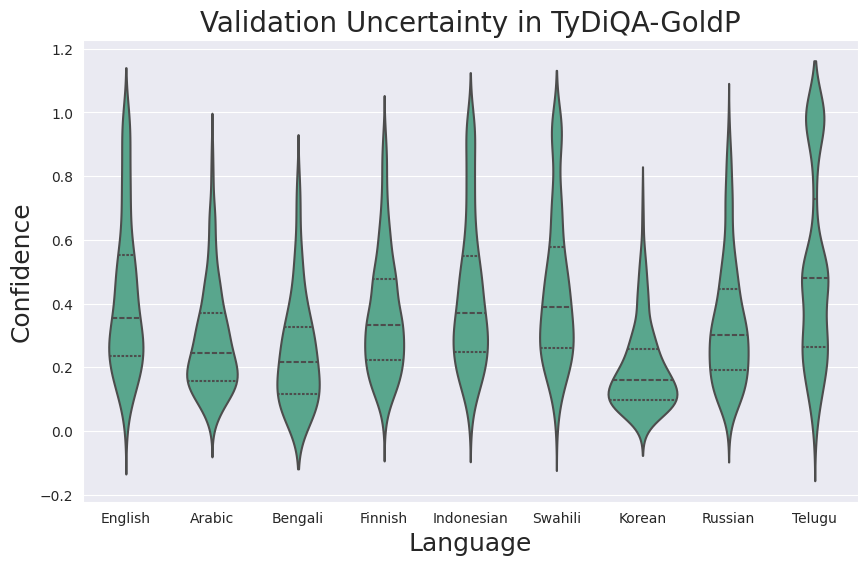
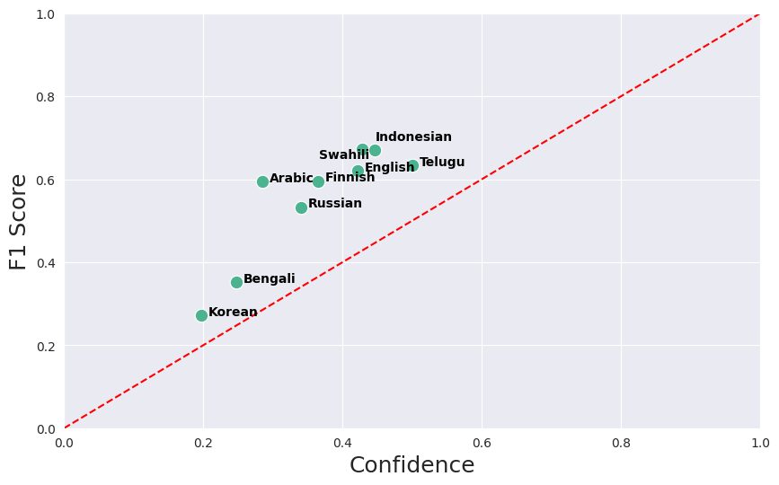

# Ensemble learning


## Task: Question and Answering, Dataset: Tydiqa gold

### Finetuning models with different configurations

Bash scripts for 5 models: [habrok/ensemble_config/QA/tydiqa](../habrok/ensemble_config/QA/tydiqa)

Results saved in: [results_small/tydiqa](../results_small/tydiqa)

The `eval_nbest_predictions.json` contains all possible predictions for an example (model predicts 20 candidates). Each candidate has a predicted text and a probability (which I treat as confidence) and also start and end logits for the answers.

Note: model 101 was not used because of its low performance so there are 4 models in total

What what changed in the configurations:
- batch size
- learning rate
- dropout prob

### Create ensemble model

Create enseble model using the previous predictions:

```
python scripts/ensemble/run_ensemble_qa.py 
results_small/tydiqa scripts/ensemble/results 4
```


Output folder: scripts/ensemble/results

Script: [scripts/ensemble/run_ensemble_qa.py](run_ensemble_qa.py )

Idea: Each example has its own set of candidate answers (20 candidates), which differ between models. In a regular approach, there is one model and you pick the candidate with the highest probability for each example. The current approach:

- Step 1: Create a pool of common candidates for each example by setting the common_cutoff (best one is 4), so select the candidates for an example which appear in all models
- Step 2: Get the confidence associated with each candidate
- Step 3: Select the candidate with the highest confidence as the final prediction

### Evaluation

[Script](compute_confidence.py) to compute mean confidence per language:

```
python scripts/ensemble/compute_confidence.py scripts/ensemble/results/eval_common_predictions_best.json scripts/ensemble/results/confidence_scores.json
```

[Script](eval_gold_passage_baseline.sh) to separate all predictions and scores (F1 score and exact match) by language. Also saves individual F1 scores to file (scripts/ensemble/results/f1_scores/final_scores_4.txt)

```
bash scripts/ensemble/eval_gold_passage_baseline.sh
```

#### F1 score comparison with PIXEL

| Language   | Arabic | Bengali | Finnish | Indonesian | Swahili | Korean | Russian | Telugu | English | Average F1 |
|------------|-------|--------|--------|-----------|--------|-------|--------|-------|--------|-----------|
| Regular | 57.3  | 36.3   | 58.3   | 63.6      | 65.9   | 26.1  | 50.5   | 63.4  | 61.7   | 52.3      |
| Ensemble | 59.5  | 35.1   | 59.6   | 67.3      | 67.1   | 27.1  | 53.3   | 63.4  | 62.1   | 54.0      |

#### Confidence per language

<p align="middle">
 </img>
</p>

#### F1 score vs confidence (Calibration) per language
 
<p align="middle">
 </img>
</p>

