# Uncertainty in PIXEL Text Reconstruction


## The effect of mask ratio on uncertainty across datasets and languages

Vary the mask ratio between 0.1 and 0.9.

Example run for mask_ratio = 0.9. The experiment type is mask_ratio.

```bash
python scripts/monte_carlo/monte_carlo_experiments.py \
  --input_data_path="scripts/data/uncertainty/test_data_ner_tydiqa_glue_1000.json" \
  --model_name_or_path="Team-PIXEL/pixel-base" \
  --experiment_type="mask_ratio" \
  --do_loss \
  --do_std \
  --mask_ratio=0.9 \
  --masking_spacing=0 \
  --masking_max_span_length=6 \
  --masking_cumulative_span_weights="0.2,0.4,0.6,0.8,0.9,1" \
  --span_mask \
  --max_seq_length=256 \
```

Inputs:
- [.json file](../data/uncertainty/test_data_ner_tydiqa_glue_1000.json) containing the test split examples in the form of text-data per id, per language, per task.

The maximum number of examples used is limited to 1000.

### NER
Counts: {'amh': 500, 'conll_2003_en': 1000, 'hau': 552, 'ibo': 638, 'kin': 605, 'lug': 407, 'luo': 186, 'pcm': 600, 'swa': 604, 'wol': 539, 'yor': 645, 'zh': 1000}

### Tydiqa
Counts: {'arabic': 921, 'russian': 812, 'bengali': 113, 'telugu': 669, 'finnish': 782, 'swahili': 499, 'korean': 276, 'indonesian': 565, 'english': 440}

### GLUE
Due to hardware limitations and time constraints, only the cola dataset was used for the experiments.

Counts: {'cola': 1000, 'mnli': 1000, 'mrpc': 1000, 'qnli': 1000, 'qqp': 1000, 'rte': 1000, 'sst2': 1000, 'stsb': 1000, 'wnli': 146}

[Outputs](results/mask_experiment_1000):
- line plot for MSE loss in terms of mask ratio, where each line is a language/dataset/script (mean values are computed)

- line plot for uncertainty (SD) in terms of mask ratio, where each line is a language/dataset/script (mean values are computed)

- line plot for GNL Loss in terms of mask ratio, where each line is a language/dataset/script (mean values are computed)

- violin plots for the loss/uncertainty/gnl across datasets (plot is too messy for languages)

#### Per tasks

##### Line plots

Interpretation: 

- Loss increases with the mask ratio because the model was trained to reconstruct the image with a ratio of 0.25. 
- GLUE contains only English data which the model was pretrained on, so the loss is lower

<p align="middle">
 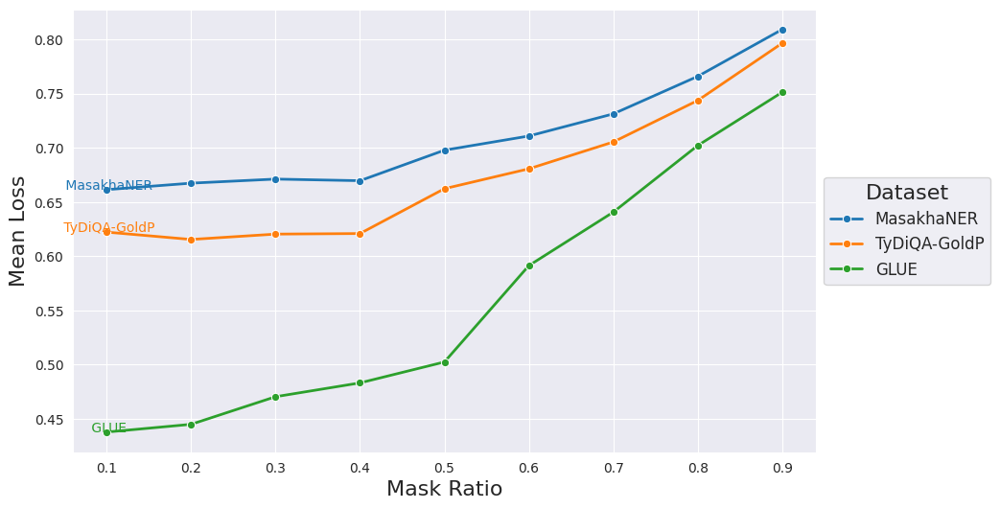</img>
</p>


Interpretation: 

- Lowest uncertainty/high confidence for a 0.7 mask ratio
- uptick in confidence for mask ratio around 0.8


<p align="middle">
 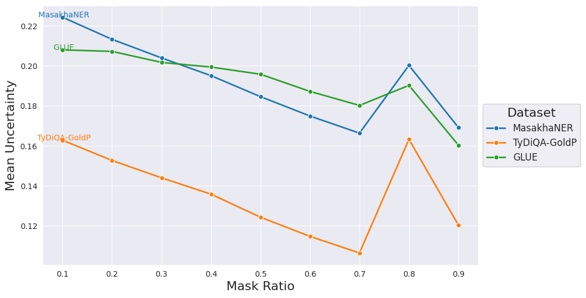</img>
</p>

<p align="middle">
 </img>
</p>


##### Violin plots

<p align="middle">
 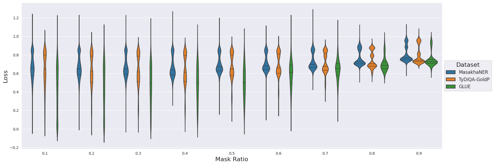</img>
</p>

<p align="middle">
 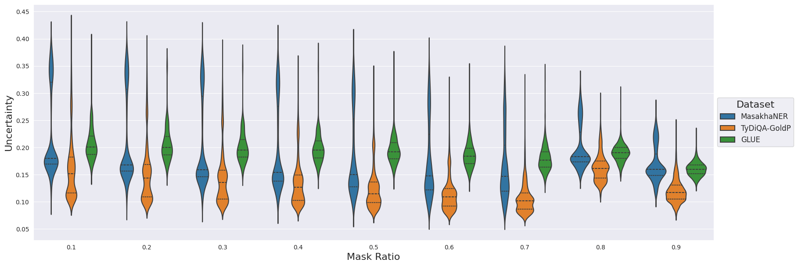</img>
</p>

<p align="middle">
 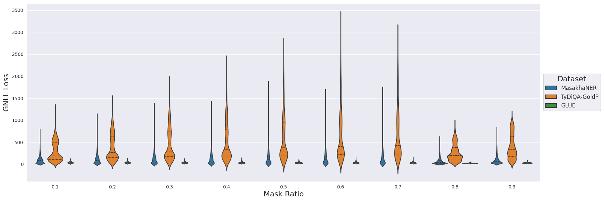</img>
</p>


#### Per script

##### Line plots


<p align="middle">
 </img>
</p>

<p align="middle">
 </img>
</p>

<p align="middle">
 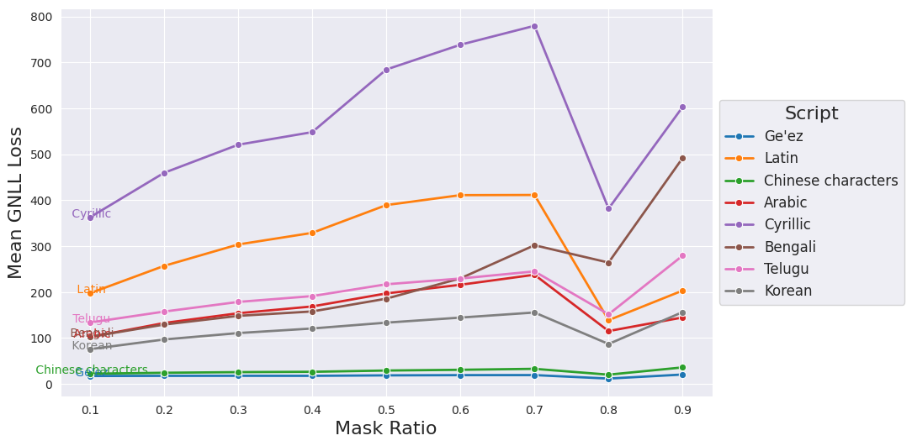</img>
</p>

##### Violin plots


<p align="middle">
 </img>
</p>


<p align="middle">
 </img>
</p>

<p align="middle">
 </img>
</p>


#### Per language

##### Line plots

Interpretation: 

- The languages with the highest loss also have a very different script from English: Korean, Arabic and Chinese
- English has the lowest loss, followed by Indonesian which has a Latin script too


<p align="middle">
 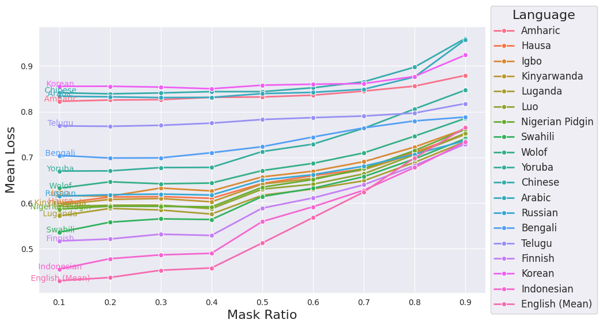</img>
</p>

Interpretation: 

- uncertainty decreases with mask ratio but the loss is increasing -> poor calibration

<p align="middle">
 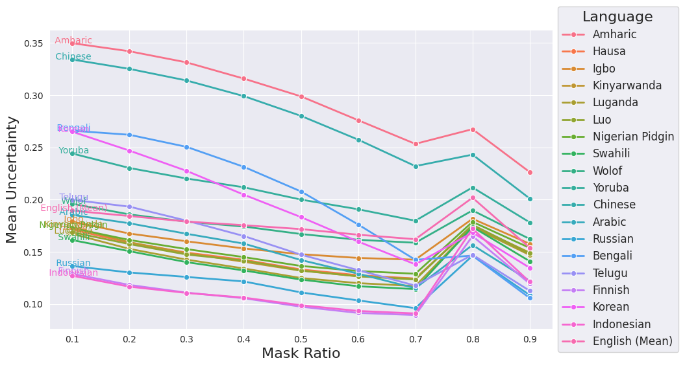</img>
</p>

<p align="middle">
 </img>
</p>

##### Violin plots


<p align="middle">
 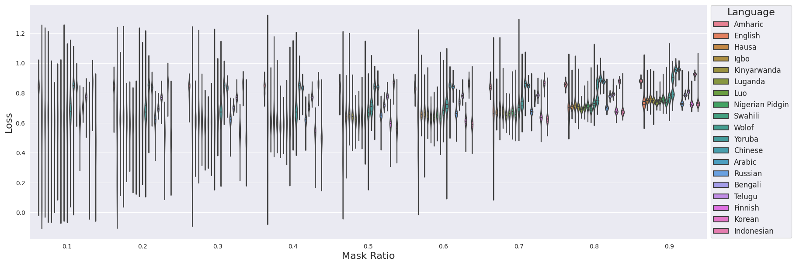</img>
</p>


<p align="middle">
 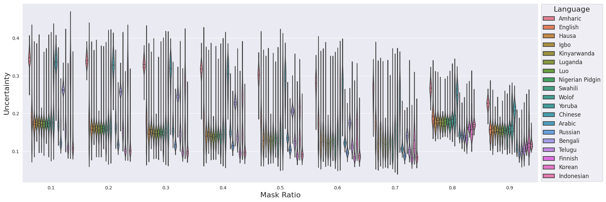</img>
</p>

<p align="middle">
 </img>
</p>


Note: for a high mask_ratio (> 0.8), the model will cap it at 0.5 because some images have very little text.

## The effect of span length on uncertainty across datasets and languages

Vary the masking_max_span_length between 1 and 6 and keep the probability to 1.

Example run for span=6. There will only be sequences of 6 consecutive patches with a probability of 100%. The experiment type is span.


```bash
python scripts/monte_carlo/monte_carlo_experiments.py \
  --model_name_or_path="Team-PIXEL/pixel-base" \
  --experiment_type="span" \
  --do_loss \
  --do_std \
  --mask_ratio=0.25 \
  --masking_max_span_length=6 \
  --masking_cumulative_span_weights="0, 0, 0, 0, 0, 1" \
  --span_mask \
  --max_seq_length=256 \
```

Inputs:
- [.json file](../data/uncertainty/test_data_ner_tydiqa_glue_1000.json) containing the 290 examples of text data per id, per language, per task. There are 10 examples per language (in the case of GLUE, this is done per subtask)

[Outputs](results/span_experiment):

- line plot for loss in terms of span length, where each line is a language/dataset/script (mean values are computed)

- line plot for uncertainty (SD) in terms of span length, where each line is a language/dataset/script (mean values are computed)

- line plot for GNL Loss in terms of span length, where each line is a language/dataset/script (mean values are computed)

- violin plots for the loss/uncertainty/gnl across datasets (plot is too messy for languages)


### Per task

#### Line plots

Interpretation: 

- Loss increases with the span length, because the reconstruction area becomes larger

<p align="middle">
 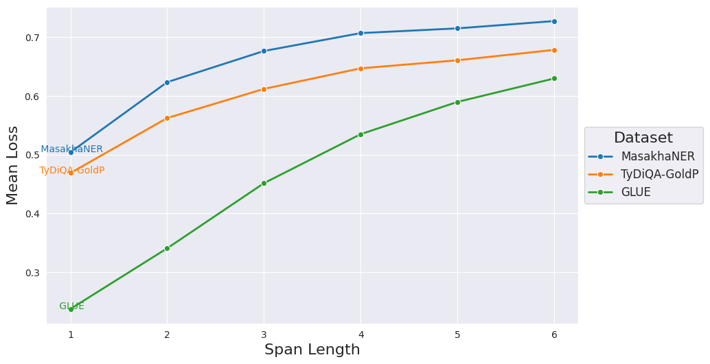</img>
</p>


<p align="middle">
 </img>
</p>

<p align="middle">
 </img>
</p>


#### Violin plots

<p align="middle">
 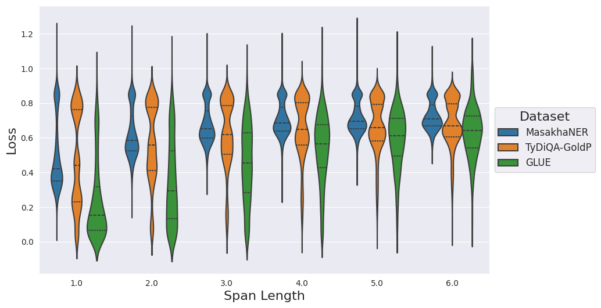</img>
</p>

<p align="middle">
 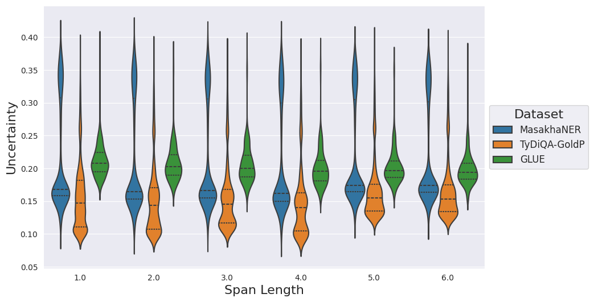</img>
</p>

<p align="middle">
 </img>
</p>

### Per script

#### Line plots

<p align="middle">
 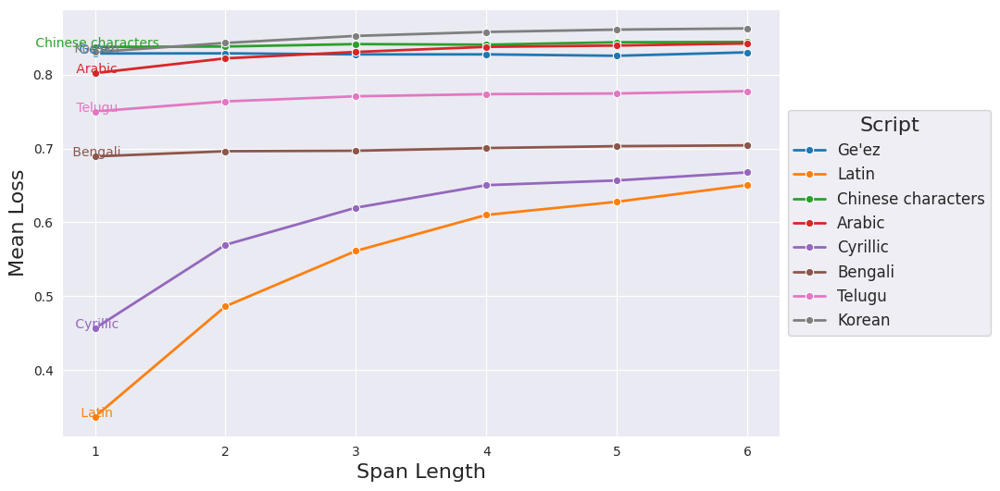</img>
</p>


<p align="middle">
 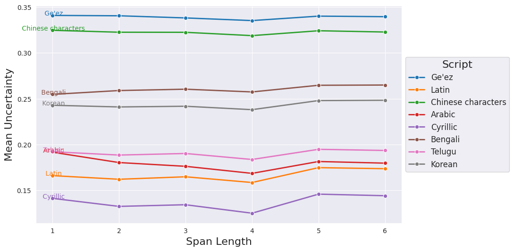</img>
</p>

<p align="middle">
 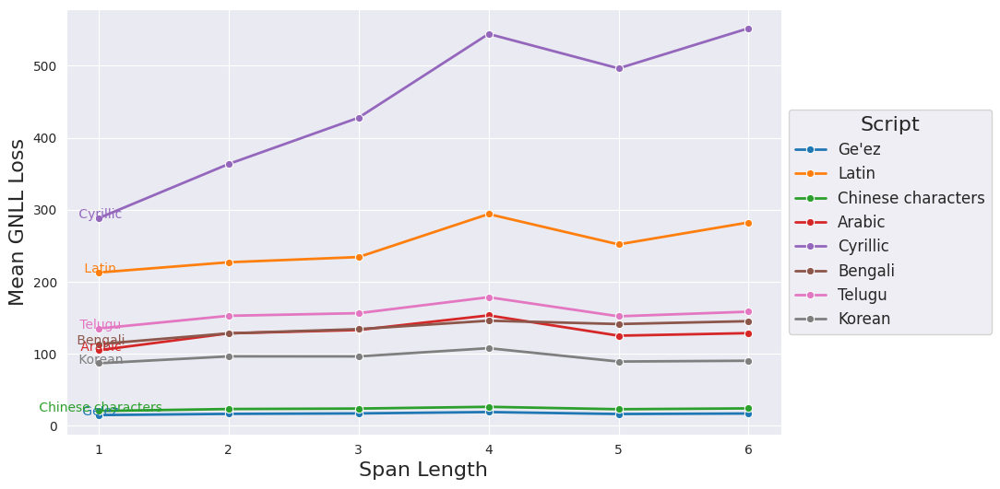</img>
</p>


#### Violin plots

<p align="middle">
 </img>
</p>

<p align="middle">
 </img>
</p>

<p align="middle">
 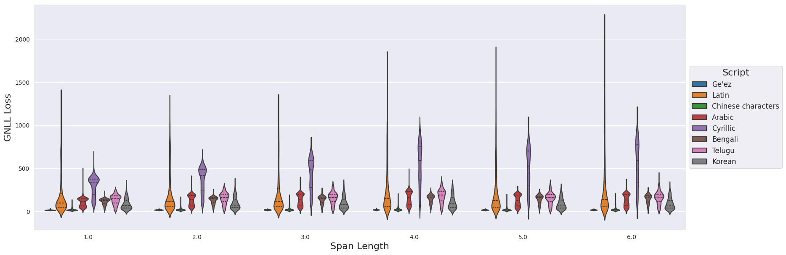</img>
</p>


### Per language

#### Line plots

<p align="middle">
 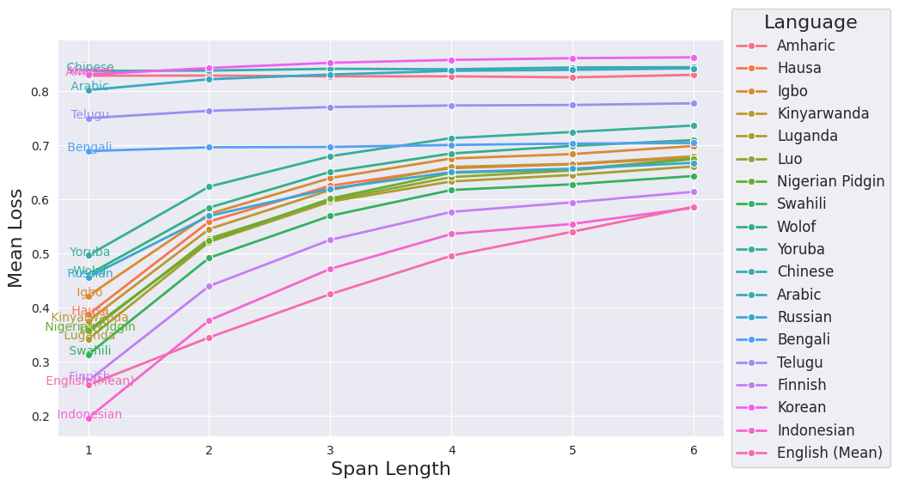</img>
</p>


<p align="middle">
 </img>
</p>

<p align="middle">
 </img>
</p>


#### Violin plots

<p align="middle">
 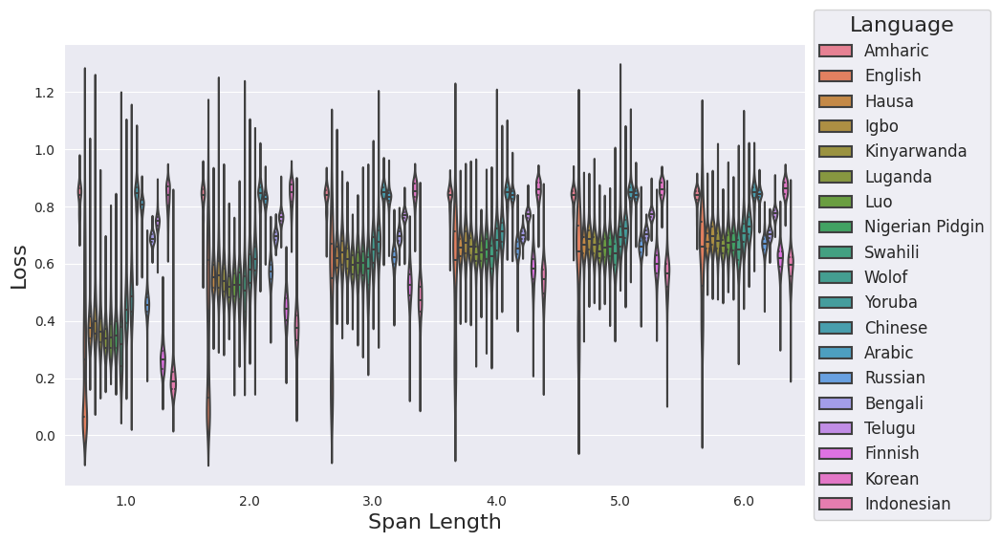</img>
</p>

<p align="middle">
 </img>
</p>

<p align="middle">
 </img>
</p>


## Visualizing uncertainty (top 5 performers + top 5 challenges in terms of GNLL Loss)

mask ratio = 0.25


To get json files:

```bash
python scripts\monte_carlo\monte_carlo_experiments.py \
  --model_name_or_path="Team-PIXEL/pixel-base" \
  --experiment_type="mask_ratio" \
  --do_loss \
  --do_std \
  --do_attention \
  --mask_ratio=0.25 \
  --masking_max_span_length=6 \
  --masking_cumulative_span_weights= "0.2,0.4,0.6,0.8,0.9,1"\
  --span_mask \
  --max_seq_length=256 \
```

To get the lowest, highest plots:

```bash
python scripts/monte_carlo/plot_monte_carlo.py
```

Inputs:
- [.json file](scripts/data/uncertainty/test_data_ner_tydiqa_glue_1000.json) containing the 290 examples of text data per id, per language, per task. There are 10 examples per language (in the case of GLUE, this is done per subtask)

Outputs:
- [loss_per_task_mask_0.25](results/base_experiment_1000/loss_per_task_mask_0.25.json) .json file with the mean loss after Monte Carlo (per id, language, task)
- [SD_per_task_mask_0.25](results/base_experiment_1000/SD_per_task_mask_0.25.json) .json file with the mean uncertainty (SD) after Monte Carlo (per id, language, task)
- [plots](results/base_experiment_1000/images) with the original, original + SD and predictions + SD for the examples with the lowest and highest GNLL loss values (5 for each)

Images are shown in the increasing order of the loss for both plots.

Interpretation: 
- Good performers: English because of pretraining

<p align="middle">
  </img>

  </img>
</p>

<!-- # Table

| Category   | Amharic | Arabic | Bengali | Chinese | CoLA | CoNLL 2003 English | English | Finnish | Hausa | Igbo | Indonesian | Kinyarwanda | Korean | Luganda | Luo | MNLI | MRPC | Nigerian Pidgin | QNLI | QQP | RTE | Russian | SST-2 | STS-B | Swahili (NER) | Swahili (TyDi QA) | Telugu | WNLI | Wolof | Yoruba |
|------------|---------|--------|---------|---------|------|--------------------|---------|---------|-------|------|------------|-------------|--------|---------|-----|------|------|-----------------|------|-----|-----|---------|-------|-------|---------------|-------------------|--------|------|-------|--------|
| Mean Loss  | 0.83    | 0.83   | 0.69    | 0.85    | 0.47 | 0.69               | 0.22    | 0.54    | 0.62  | 0.62 | 0.52       | 0.60        | 0.85   | 0.60    | 0.58| 0.23 | 0.29 | 0.56            | 0.22 | 0.35| 0.21| 0.63    | 0.48  | 0.24  | 0.59          | 0.51              | 0.77   | 0.18 | 0.68  | 0.65   |
| Mean SD    | 0.15    | 0.05   | 0.10    | 0.14    | 0.06 | 0.10               | 0.03    | 0.04    | 0.04  | 0.04 | 0.02       | 0.04        | 0.08   | 0.04    | 0.04| 0.05 | 0.06 | 0.04            | 0.05 | 0.04| 0.04| 0.03    | 0.05  | 0.05  | 0.04          | 0.03              | 0.04   | 0.05 | 0.05  | 0.09   | -->


## The Attention mechanism in the PIXEL model

Inputs:
- the worst and best predictions w.r.t the loss from the previous experiment
- (predicitons with the lowest and highest uncertainty?)

Outputs:
- attention grid like bertviz and close-ups (specific layer/head) for the worst and best predictions w.r.t the loss


<p align="middle">
 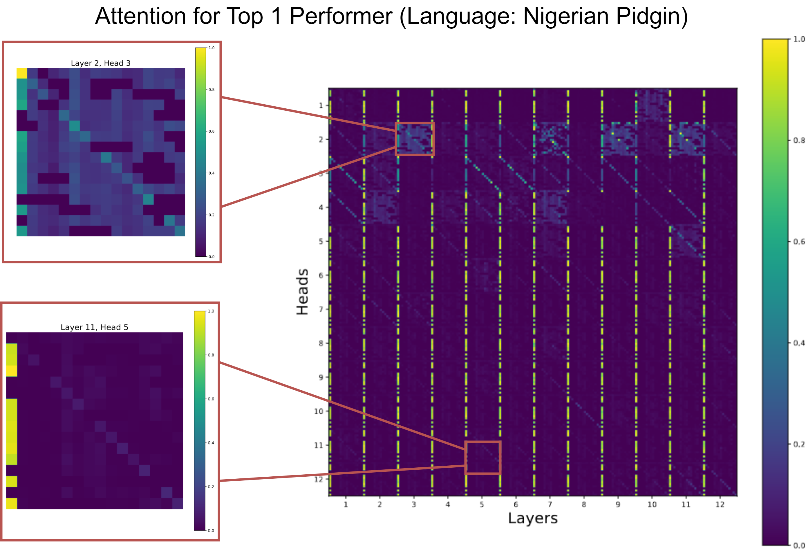</img>
</p>


<p align="middle">
 </img>
</p>

Run: run script from before with do-attention flag

## Calibration plots across tasks and languages for the original pixel model

Script:

```
python scripts/monte_carlo/calibration_plots_experiments.py
```

<p align="middle">
 </img>
  </img>
</p>

<p align="middle">
 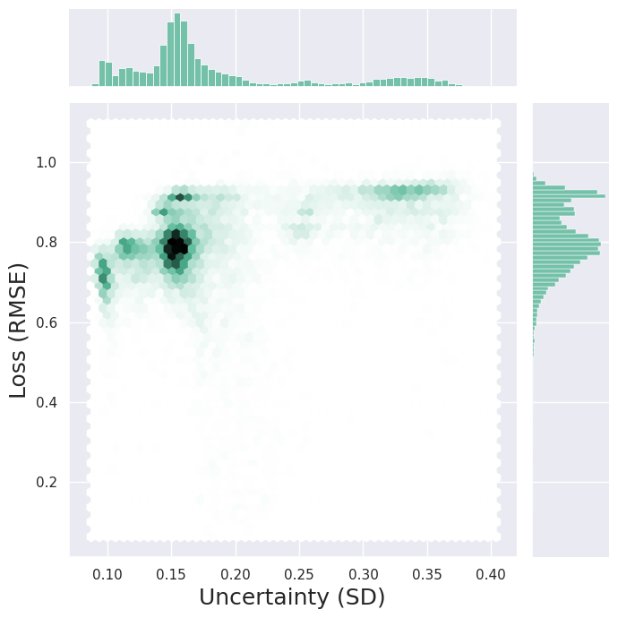</img>
</p>
